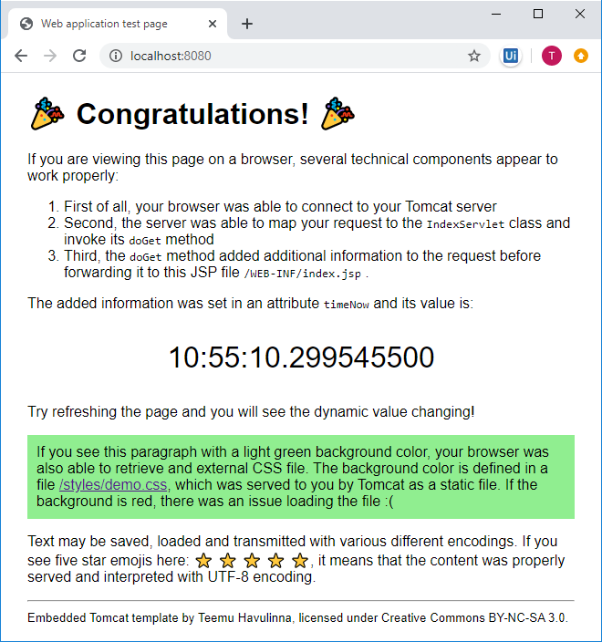

# Embedded Tomcat -projektipohja [](https://travis-ci.org/haagahelia/embedded-tomcat-template)

Tämä malliprojekti on tarkoitettu pohjaksi verkkosovellusten koodaamiseen Haaga-Helian Ohjelmointi 2 -opintojaksolla. Projektissa hyödynnetään Javan Servlet- sekä JSP-teknologioita yhdessä [Apachen Tomcat](http://tomcat.apache.org/) -sovelluspalvelimen kanssa. Projekti sisältää valmiit asetustiedostot sen tuomiseksi Eclipse-sovelluskehittimeen, mutta voit käyttää sitä soveltaen myös muilla kehitystyökaluilla, kuten [VS Code](https://code.visualstudio.com/) tai [IntelliJ IDEA](https://www.jetbrains.com/idea/).

## Suositeltua taustamateriaalia

**[Introduction to Servlets](https://youtu.be/7TOmdDJc14s)**

Tämä video esittelee perusteet HTTP-palvelimen toiminnassa dynaamisten sivujen (servlet) käsittelyssä. Servlettien rakenne sekä yhteys servlettien ja Tomcatin välillä esitetään tällä videolla varsin selkeällä tavalla.

## Projektin kopioiminen

Voit tallentaa projektin lähdekoodit itsellesi GitHub-palvelusta monilla eri tavoilla. Yksinkertaisimmillaan voit tallentaa sen [zip-pakettina](https://github.com/haagahelia/embedded-tomcat-template/archive/master.zip), jonka tuot itsellesi Eclipseen import-ominaisuudella. 

Mikäli haluat käyttää omassa työssäsi versionhallintaa, voit kloonata projektin joko [Eclipsen Git-pluginin](https://www.google.com/search?q=git+clone+eclipse) tai jonkin ulkoisen [Git-käyttöliittymän](https://www.google.com/search?q=git+bash+clone) avulla. Toinen vaihtoehto on luoda tästä projektista linkitetty kopio, eli ["fork", jossa voit kokeilla vapaasti omia muutoksiasi](https://github.community/t5/Support-Protips/The-difference-between-forking-and-cloning-a-repository/ba-p/1372).

## Projektin tiedostot

Esimerkkiprojekti noudattaa seuraavaa hakemistorakennetta:

```tree
embedded-tomcat
│   pom.xml
│   README.md
│
├───src
│   ├───main
│   │   ├───java
│   │   │   ├───launch
│   │   │   │       Main.java
│   │   │   │
│   │   │   └───servlet
│   │   │           IndexServlet.java
│   │   │
│   │   ├───resources
│   │   └───webapp
│   │       ├───styles
│   │       │       demo.css
│   │       │
│   │       └───WEB-INF
│   │               index.jsp
│   │
│   └───test
│       ├───java
│       └───resources
```

Sijainti                                | Tarkoitus
----------------------------------------|---------------------
[README.md](README.md)                                                  | Tämä tiedosto
[pom.xml](pom.xml)                                                      | "[Project Object Model](https://maven.apache.org/guides/getting-started/maven-in-five-minutes.html)"-tiedosto mm. riippuvuuksien määrittelemiseksi
[src/main/java](src/main/java)                                          | Java-pakettien juurihakemisto
[src/main/resources](src/main/resources)                                | Hakemisto esimerkiksi .properties-tiedostoille
[src/main/java/launch/Main.java](src/main/java/launch/Main.java)        | Luokka Tomcat-palvelimen käynnistämiseksi
[src/main/java/servlet/IndexServlet.java](src/main/java/servlet/IndexServlet.java) | Esimerkki HTTP-liikennettä tukevasta Java-luokasta
[src/main/webapp](src/main/webapp)                                      | Hakemisto staattisille tiedostoille (css, kuvat, JS)
[src/main/webapp/WEB-INF](src/main/webapp/WEB-INF)                      | Erityinen hakemisto, jonne on estetty suora pääsy selaimilta ¹
[src/main/webapp/WEB-INF/index.jsp](src/main/webapp/WEB-INF/index.jsp)  | IndexServlet-luokan käyttämä sivupohja
[src/test/java](src/test/java)                                          | JUnit-testiluokkien pakettien juurihakemisto
[src/test/resources](src/test/resources)                                | Hakemisto esimerkiksi testien .properties-tiedostoille

¹ "No file contained in the WEB-INF directory may be served directly to a client by the container. However, the contents of the WEB-INF directory are visible to servlet code..." [Java Servlet Specification Version 2.4](http://download.oracle.com/otn-pub/jcp/servlet-2.4-fr-spec-oth-JSpec/servlet-2_4-fr-spec.pdf)


## Riippuvuuksien asentaminen

Servlet-pohjaiset sovellukset tarvitsevat aina jonkin suoritusympäristön, joka tällä esimerkkiprojektilla on nimeltään [Tomcat](http://tomcat.apache.org/). Tomcat ja muut sovelluksen riippuvuudet on suoraviivaista määrittää projektin pom.xml-tiedostoon, jolloin Eclipsen Maven-plugin asentaa riippuvuudet automaattisesti.

Kun riippuvuudet on asennettu, on Tomcat-palvelinohjelmisto käytettävissä projektissasi ja voit ryhtyä kehittämään verkkosovelluksia Javalla.

*Tämän projektin `pom.xml` on rakennettu noudattaen Heroku-pilvialustan esimerkkiä ["Create a Java Web Application Using Embedded Tomcat"](https://devcenter.heroku.com/articles/create-a-java-web-application-using-embedded-tomcat).*


## Palvelinohjelmiston käynnistäminen

Tomcat-palvelin voidaan käynnistää lukuisilla eri tavoilla, esimerkiksi erillisenä ohjelmana tai Eclipsen hallinnoimana palvelimena. Voimme käyttää sitä myös ohjelmallisesti, eli kirjoittamalla tavallista Java-koodia.

Tämä yksinkertaistettu esimerkki näyttää, miten uusi Tomcat-olio luodaan, miten sen käyttämä portti määritellään ja miten palvelin käynnistetään odottamaan HTTP-pyyntöjä:

```java
import org.apache.catalina.startup.Tomcat;

public class Main {

    public static void main(String[] args) throws Exception {

        // Luodaan uusi palvelinolio:
        Tomcat tomcat = new Tomcat();

        // Asetetaan kuunneltava portti (http://localhost:8080)
        tomcat.setPort(8080);

        // ...muiden asetusten määrittely...

        // Palvelimen käynnistäminen:
        tomcat.start();
        tomcat.getServer().await();
    }
}
```

## Main.java-tiedosto

Tässä projektissa Tomcatin käynnistämiseksi ja sen asetusten asettamiseksi tarvittavat komennot on kirjoitettu valmiiksi tiedostoon [`src/main/java/launch/Main.java`](src/main/java/launch/Main.java). Voit käynnistää Tomcat-palvelimen suorittamalla tämän tiedoston aivan kuten olet tähänkin asti suorittanut Java-ohjelmiasi Eclipsessä.

Ohjelman suoritus tulostaa lokitietoja Eclipsen konsoliin, ja onnistunut käynnistys näyttää pääpiirteittäin tältä:

```log
configuring app with basedir: C:\workspace\embedded-tomcat\.\src\main\webapp
tammik. 28, 2020 10:13:05 AP. org.apache.coyote.AbstractProtocol init
INFO: Initializing ProtocolHandler ["http-nio-8080"]
tammik. 28, 2020 10:13:05 AP. org.apache.tomcat.util.net.NioSelectorPool getSharedSelector
INFO: Using a shared selector for servlet write/read
tammik. 28, 2020 10:13:05 AP. org.apache.catalina.core.StandardService startInternal
INFO: Starting service [Tomcat]
tammik. 28, 2020 10:13:05 AP. org.apache.catalina.core.StandardEngine startInternal
INFO: Starting Servlet Engine: Apache Tomcat/8.5.50
tammik. 28, 2020 10:13:06 AP. org.apache.catalina.startup.ContextConfig getDefaultWebXmlFragment
INFO: No global web.xml found
tammik. 28, 2020 10:13:06 AP. org.apache.jasper.servlet.TldScanner scanJars
INFO: At least one JAR was scanned for TLDs yet contained no TLDs. Enable debug logging for this logger for a complete list of JARs that were scanned but no TLDs were found in them. Skipping unneeded JARs during scanning can improve startup time and JSP compilation time.
tammik. 28, 2020 10:13:06 AP. org.apache.catalina.util.SessionIdGeneratorBase createSecureRandom
WARNING: Creation of SecureRandom instance for session ID generation using [SHA1PRNG] took [308] milliseconds.
tammik. 28, 2020 10:13:06 AP. org.apache.coyote.AbstractProtocol start
INFO: Starting ProtocolHandler ["http-nio-8080"]
```

Voit nyt navigoida selaimellasi osoitteeseen [http://localhost:8080](http://localhost:8080)! Mikäli kaikki toimii, näet sivun joka näyttää tältä:



Esimerkkisivu selostaa muutamia vaiheita, jotka palvelinohjelmisto kävi läpi toteuttakseen vastauksen selaimesi pyyntöön. Käymme nämä vaiheet läpi seuraavissa luvuissa.

Mikäli tuloste sisältää seuraavanlaisia virheilmoituksia, portti 8080 on jo varattuna koneellasi ja joudut sulkemaan käynnissä olevan Tomcat-palvelimen alla olevan ohjeen mukaisesti.

```log
INFO: Initializing ProtocolHandler ["http-nio-8080"]
tammik. 28, 2020 10:17:42 AP. org.apache.catalina.core.StandardService initInternal
SEVERE: Failed to initialize connector [Connector[HTTP/1.1-8080]]
org.apache.catalina.LifecycleException: Protocol handler initialization failed
	at org.apache.catalina.connector.Connector.initInternal(Connector.java:995)
	at org.apache.catalina.util.LifecycleBase.init(LifecycleBase.java:136)
	...
	at launch.Main.main(Main.java:44)
Caused by: java.net.BindException: Address already in use: bind
	at java.base/sun.nio.ch.Net.bind0(Native Method)
	at java.base/sun.nio.ch.Net.bind(Net.java:461)
```

### Palvelinohjelmiston *uudelleenkäynnistys*

Tomcat on konfiguroitu lataamaan muuttuneet Java-luokat uudelleen automaattisesti ilman uudelleenkäynnistystä. Kun teet muutoksia ja tallennat tiedostoja, käännetään muuttuneet tiedostot automaattisesti ja Tomcat lataa ne uudelleen:

```
tammik. 28, 2020 10:14:57 AP. org.apache.catalina.core.StandardContext reload
INFO: Reloading Context with name [] is completed
```

Joidenkin isompien muutosten, kuten uusien tiedostojen luomisen yhteydessä, Tomcat ei pysty lataamaan muutoksia "lennossa". Tällöin joudut pysäyttämään palvelimen ensin Eclipsen Console-näkymän [oikeassa yläkulmassa olevasta punaisesta "terminate"-painikkeesta](https://stackoverflow.com/a/1515229) ja käynnistämään `Main.java`-tiedoston uudelleen.


## Servlet-pohjaisen sovelluksen anatomia

Java EE -spesifikaatiossa on määriteltynä tapa, jolla Java-luokat voivat kommunikoida verkkoyhteyksistä huolehtivien sovelluspalvelimien kanssa. Tämän määrittelyn toteuttavista luokista käytetään termiä "servlet".

### Yläluokka ja annotaatiot
Teknisesti servletit toteutetaan aivan tavallisina Java-luokkina, jotka:
1. perivät `javax.servlet.http.HttpServlet`-luokan: `extends HttpServlet`
2. annotoidaan `javax.servlet.annotation.WebServlet`-annotaatiolla: `@WebServlet("/hello")`

Kun perimme (extend) `HttpServlet`-luokan, Tomcat tunnistaa luokan servletiksi. `@WebServlet`-annotaatio puolestaan kertoo Tomcatille, mikä servletin polku on palvelimella.

`HttpServlet`-luokka sisältää ylikirjoitettavat metodit mm. `GET`- ja `POST`-tyyppisille HTTP-pyynnöille:
* `doGet`
* `doPost`
* `doHead`
* `doPut`
* `doDelete`
* ...

Alla oleva esimerkkiluokka on annotoitu `@WebServlet("/hello")`-annotaatiolla, eli tätä servlettiä käytetään `/hello`-polkuun tuleviin pyyntöihiin vastaamisessa. Koska luokka ylikirjoittaa (`@Override`) `HttpServlet`-luokan `doGet`-metodin, käytetään tätä servlettiä ainoastaan HTTP GET -tyyppisten pyyntöjen käsittelyyn. Koska metodi ei sisällä lainkaan vastaamiseen tarvittavaa logiikkaa, selaimelle palautetaan vain tyhjä sivu.

```java
import java.io.IOException;
import java.time.LocalTime;

import javax.servlet.ServletException;
import javax.servlet.annotation.WebServlet;
import javax.servlet.http.HttpServlet;
import javax.servlet.http.HttpServletRequest;
import javax.servlet.http.HttpServletResponse;

@WebServlet("/hello")
public class HelloServlet extends HttpServlet {

    @Override
    protected void doGet(HttpServletRequest req, HttpServletResponse resp) throws ServletException, IOException {
        // TODO: implement request handling here
    }
}
```

### HttpServletRequest ja HttpServletRequest

`HttpServlet`-luokan HTTP-pyyntöjä käsittelevät metodit saavat aina parametreinaan kaksi oliota:

`javax.servlet.http.HttpServletRequest` sisältää tiedot saadusta http-pyynnöstä:
  * Evästeet
  * Otsikot (HTTP headers)
  * HTTP-parametrit
  * ...

`javax.servlet.http.HttpServletResponse` on olio, jonka kautta voidaan lähettää vastaus saatuun pyyntöön. Vastaus voidaan esim. kirjoittaa `println()`-metodilla pyytämällä `HttpServletResponse`-oliolta writer-olio. Writer saadaan `getWriter()`-metodilla, jonka `println`-metodia voidaan kutsua seuraavasti:

```java
@Override
protected void doGet(HttpServletRequest req, HttpServletResponse resp) 
        throws ServletException, IOException {

    // tulostaa tekstin HTTP-vastaukseen (ei konsoliin)
    resp.getWriter().println("Hello world");
}
```

HTML-muotoisten vastausten muodostaminen edellyttäisi, että sekoitamme Java-koodia ja HTML:ää, mistä tulisi nopeasti vaikeaselkoista ja huonosti ylläpidettävää:

```java
/* Tässä esimerkissä on hyödynnetty Java 13:n TextBlock-ominaisuutta 
 * monirivisen merkkijonon muodostamiseksi: https://wiki.eclipse.org/Java13/Examples */
@Override
protected void doGet(HttpServletRequest req, HttpServletResponse resp) 
        throws ServletException, IOException {

    // FIXME: vaikeasti ylläpidettävää koodia!
    resp.getWriter().println("""
            <html>
                <head>
                    <title>Hello</title>
                </head>
                <body>
                    <h1>Hello world!</h1>
                </body>
            </html>
        """);
}
```

Vaikka siis periaatteessa voisimme generoida HTML-muotoiluja tulostamalla, ei se olisi tehokasta eikä kovin helposti ylläpidettävää. HTML-rakenteet kannattaakin muodostaa Java-luokkien ulkopuolisten sivupohjien avulla, joihin tutustumme seuraavaksi.

### Pyyntöön vastaaminen HTML-sivulla

Servlet-teknologialla toteutettujen palveluiden käyttöliittymät toteutetaan usein JSP-sivuina. Logiikka, kuten pyyntöön liittyvän datan lukeminen ja tietokantahaut, puolestaan toteutetaan servleteissä. Kun kaikki pyynnön käsittelyyn liittyvä logiikka on saatu suoritettua, voidaan pyyntö välittää servletiltä JSP-sivulle.

Alla olevassa esimerkkiluokassa servletissä ensin muodostetaan nykyistä kellonaikaa vastaava merkkijono, joka asetetaan pyyntöön uudeksi attribuutiksi request-olion `setAttribute`-metodilla. Tämä metodi toimii hyvin samalla periaatteella kuin `Map`-tietorakenne, eli attribuutti annetaan avain-arvo-parina, jossa on avain "timeNow" ja sitä vastaava arvo. Arvo on tässä tapauksessa merkkijono, mutta se voisi olla periaatteessa mitä tahansa muutakin. Usein JSP-sivuille välitetään esimerkiksi listoja tietokannasta haetuista oliosta.

Viimeisellä rivillä pyyntö välitetään eteenpäin `/WEB-INF/index.jsp`-sivulle. Pyynnön välittämiseksi tarvitaan `RequestDispatcher`-olio ja kyseinen rivi voi vaikuttaa vaikeaselkoiselta. Käytännössä voit välittää pyynnöt aina tällä tavalla, vaihda vain käytetyn JSP-sivun sijainti servlet-kohtaisesti:

```java
package servlet;

import java.io.IOException;
import java.time.LocalTime;

import javax.servlet.ServletException;
import javax.servlet.annotation.WebServlet;
import javax.servlet.http.HttpServlet;
import javax.servlet.http.HttpServletRequest;
import javax.servlet.http.HttpServletResponse;

@WebServlet("")
public class IndexServlet extends HttpServlet {

    @Override
    protected void doGet(HttpServletRequest req, HttpServletResponse resp) throws ServletException, IOException {
        String timeString = LocalTime.now().toString();

        // pass the time string to the JSP page as an attribute
        req.setAttribute("timeNow", timeString);

        // forward the request to the index.jsp page
        req.getRequestDispatcher("/WEB-INF/index.jsp").forward(req, resp);
    }
}
```
Huomaa, että JSP-sivun polku annetaan suhteessa `webapp`-hakemistoon, jossa säilytetään myös palvelun staattisia tiedostoja, kuten kuvia, tyylitiedostoja ja JavaScript-tiedostoja.  `WEB-INF`-alihakemistossa sijaitsevat JSP-sivut ovat turvassa suorilta selainten pyynnöiltä, eli niihin pääsee käsiksi ainoastaan servlettien kautta.

### HTML-sivun JSP-teknologialla

Edellisen kappaleen esimerkissä pyyntö välitetään [`/WEB-INF/index.jsp`](src/main/webapp/WEB-INF/index.jsp)-tiedostolle. Tiedoston sisältö on typistettynä seuraava:

```jsp
<%@ page language="java" contentType="text/html; utf-8"
	pageEncoding="utf-8"%>
<!DOCTYPE html>
<html>
<head>
	<meta charset="utf-8">
	<title>Web application test page</title>
	<link rel="stylesheet" href="/styles/demo.css">
</head>
<body>

	<h1>🎉 Congratulations! 🎉</h1>

	<!-- content removed for brevity -->
	<p>
		The added information was set in an attribute
		<code>timeNow</code>
		and its value is:
	</p>
	<p class="time-now">${ timeNow }</p>

	<!-- content removed for brevity -->
</body>
</html>
```

Sivu on suurilta osin tavallinen HTML-tiedosto. Suurimmat erot ovat ensimmäisellä rivillä oleva JSP-syntaksin mukainen page-direktiivi sekä sivun alaosassa esiintyvä `<p>`-kappale:

```html
<p class="time-now">${ timeNow }</p>
```

Direktiivien avulla voidaan vaikuttaa siihen, miten Tomcat-palvelin muodostaa vastauksen tätä tiedostoa hyödyntäen. `${ timeNow }`-kohta puolestaan on JSP-sivuilla käytettävän [Expression Language -kielen](https://javaee.github.io/tutorial/jsf-el.html) lauseke. Lausekkeiden avulla sivulla voidaan käyttää Javan tietorakenteita ja tässä tapauksessa, kun lauseke on osana sivun HTML-sisältöä, tulee lausekkeen arvo sivulle tekstinä. Tässä lausekkeessa arvona on ainostaan `timeNow`, joka on sama merkkijono, kuin jonka annoimme edellä servletissä attribuutin nimenä. Tämän nimen kautta löytyy se merkkijono, joka annettiin `setAttribute`-metodin toisena parametrina, eli nykyinen kellonaika merkkijonona.

JSP-sivua renderöitäessä lausekkeen tilalle ilmestyy siis kellonaika, esim:

```html
<p class="time-now">10:55:10.299545500</p>
```

### Staattiset tiedostot

Edellä esitellyssä sivupohjassa hyödynnetään ulkoista CSS-tiedostoa:

```html
<link rel="stylesheet" href="/styles/demo.css">
```

Tämä tiedosto sijaitsee projektin hakemistossa `src/main/webapp`, jonka alla olevat tiedostot tarjotaan selaimelle staattisina tiedostoina (poikkeuksena `WEB-INF`).

Selaimen pyytäessä osoitetta http://localhost:8080/styles/demo.css Tomcat tarjoaa vastauksesi CSS-tiedostomme. Vastaavalla tavalla voisimme asettaa saataville myös kuvat ja JavaScript-tiedostot.

```css
/* this stylesheet is only used for verifying that serving static files works */
body {
	max-width: 600px;
	margin: 0 auto;
	font-family: sans-serif;
}
.external-css {
	background-color: #90EE90;
	padding: 10px;
}
.time-now {
	text-align: center;
	font-size: 2em;
}
```

## Seuraavat askeleet

Seuraavaksi sinun kannattaa luoda projektiin uusia servlettejä ja JSP-sivuja ja tutustua niiden toimintaan. 

Tutustu myös JSP-sivujen sisällä käytettävään [JSTL-kirjastoon tutoriaalien avulla](https://www.google.com/search?q=jstl+tutorial). JSTL (JSP Standard Tag Library) mahdollistaa mm. tekstin turvallisen tulostamisen `c:out`-tagin avulla ja kokoelmien läpikäynnin `c:forEach`-tagin avulla.

[Lomakkeiden käsittelemiseksi](https://www.google.com/search?q=servlet+form+handling) sinun kannattaa tutustua `doPost`-metodiin ja pyynnön mukana tulleiden arvojen käyttämiseksi tarkoitettuun `getParameter`-metodiin. 

Java varoittaa servlet-luokkien yhteydessä tyypillisesti seuraavaa: 

>"The serializable class XYZ does not declare a static final serialVersionUID field of type long"

Voit jättää tämän varoituksen huomioimatta. `serialVersionUID` nimistä muuttujaa käytetään luokasta luotujen olioiden versiointiin, lue tarvittaessa lisää [täältä](https://stackoverflow.com/a/285809).

---

Tämän oppimateriaalin on kehittänyt Teemu Havulinna ja se on lisensoitu [Creative Commons BY-NC-SA](https://creativecommons.org/licenses/by-nc-sa/4.0/) -lisenssillä. 
