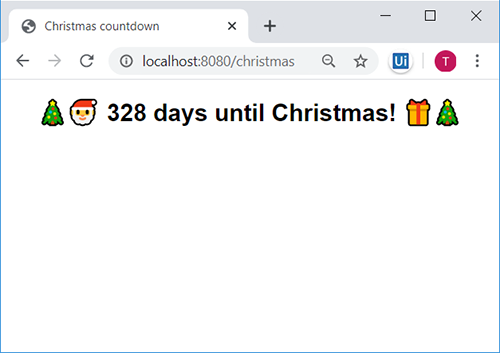
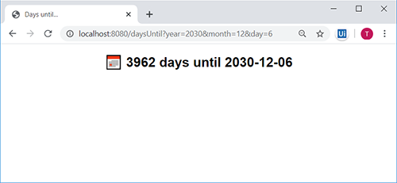

[⇦ takaisin kurssin etusivulle](../)

# Web-ohjelmointi servleteillä

Huom! Tässä vaiheessa on hyvä varmistaa, että käytössäsi on *"Eclipse IDE for Enterprise Java Developers"*, *"Eclipse Java EE IDE for Web Developers"* tai vastaavalla nimellä kutsuttu jakelupaketti, joka sisältää verkkosovellusten tekoon tarvitut laajennukset. Tämä selviää "Help"-valikosta kohdasta "About Eclipse IDE" ([lisäohjeita](https://stackoverflow.com/questions/12106980/how-to-see-my-eclipse-version/12107098)).

Mikäli Eclipse-versiosi ei ole soveltuva, asenna uusi versio osoitteesta [https://www.eclipse.org/downloads/packages/](https://www.eclipse.org/downloads/packages/).


## Oppimistavoitteet

Tällä viikolla päätavoitteena on tutustua Javan web-kehityksessä käytettäviin työkaluihin ja termistöön:

* Servlet
* JSP: JavaServer Pages
* Tomcat
* Git-versionhallinta


<!--## Malliratkaisu

Tämän tehtävän palautusaika on umpeutunut. Voit katsoa malliratkaisun lähdekoodit GitHubista:

* [Servletit](https://github.com/haagahelia/embedded-tomcat-template/tree/kevat2020/src/main/java/servlet)
* [JSP-sivut](https://github.com/haagahelia/embedded-tomcat-template/tree/kevat2020/src/main/webapp/WEB-INF)
-->


### Video 1: [Johdatus HTTP-protokollaan ja Tomcatiin + Git clone](https://web.microsoftstream.com/video/710ad286-f65f-442b-ba25-2fc5da82d522) <small>21:41</small>

<iframe width="640" height="360" src="https://web.microsoftstream.com/embed/video/710ad286-f65f-442b-ba25-2fc5da82d522?autoplay=false&amp;showinfo=true" allowfullscreen style="border:none;"></iframe>

Tällä videolla tutustumme HTTP-protokollaan ja siihen liittyviin pyyntöihin ja vastauksiin. Tutustumme siihen, miten sovelluspalvelin välittää HTTP-pyynnöt Java-ohjelmallemme ja miten ohjelmamme vastaa pyyntöön siten, että vastaus päätyy käyttäjän selaimelle. Kloonaamme myös GitHubista projektipohjan, jota käytämme jatkossa web-sovelluksemme pohjana.

Projektipohjan dokumentaatio ja lähdekoodit löytyvät GitHub-palvelusta osoitteesta [https://github.com/ohjelmointi2/embedded-tomcat-template](https://github.com/ohjelmointi2/embedded-tomcat-template).

&nbsp;


## Kurssin projektipohja

[Kurssin projektipohja](https://github.com/ohjelmointi2/embedded-tomcat-template) käyttää Tomcat-sovelluspalvelinta "upotettuna" Java-projektiisi (embedded Tomcat). Projekti on rakennettu siten, että sen riippuvuuksia hallitaan automaattisesti Maven-työkalun avulla. Maven-työkalun avulla projektin riippuvuudet, kuten web-palvelin, on mahdollista asentaa automaattisesti.

Maven-plugin löytyy Eclipsestä valmiiksi asennettuna, joten et tarvitse Mavenin käyttämiseksi erillisiä asennuksia tai asetuksia. Eclipse osaa siis Mavenin kanssa asentaa mm. Tomcatin ja muut projektin mahdolliset riippuvuudet automaattisesti. Tomcatia voitaisiin käyttää myös lukuisilla muilla tavoilla, joten löydät mahdollisesti netistä ohjeita, jotka eivät täysin vastaa omia asetuksiasi ja asennustapojasi. 

Projektipohjan asennustapa on todettu kohtuullisen helpoksi ja samat tavat ovat hyödynnettävissä myös muilla kehitystyökaluilla (esim. [VS Code](https://code.visualstudio.com/), [IntelliJ IDEA](https://www.jetbrains.com/idea/)) ja erilaisissa suoritusympäristöissä (esim. [Heroku-pilvialusta](https://devcenter.heroku.com/articles/create-a-java-web-application-using-embedded-tomcat), [Spring boot -sovelluskehys](https://www.springboottutorial.com/spring-boot-with-embedded-servers-tomcat-jetty)).

Voit halutessasi lukea lisää Mavenista artikkelista ["Maven in 5 Minutes"](https://maven.apache.org/guides/getting-started/maven-in-five-minutes.html) tai keskustelusta ["Is Maven similar to npm?"](https://stackoverflow.com/a/38392716)

🛈 *Projektipohja tarvitsee toimiakseen Java-version 9 tai uudemman. Jos näyttää siltä, että projekti ei yksinkertaisesti toimi tai että siinä näkyy kasapäin virheitä, [tarkista Javan versio](https://www.google.com/search?q=how+to+check+java+version) ja tarvittaessa [päivitä Java-asennuksesi](https://www.google.com/search?q=how+to+update+java).*


### Video 2: [Maven ja Tomcat malliprojektissa](https://web.microsoftstream.com/video/527282e4-961e-453e-a350-af766e50559f) <small>15:31</small>

<iframe width="640" height="360" src="https://web.microsoftstream.com/embed/video/527282e4-961e-453e-a350-af766e50559f?autoplay=false&amp;showinfo=true" allowfullscreen style="border:none;"></iframe>

Tällä videolla tutustumme web-projektimme hakemisto- ja luokkarakenteeseen. Selvitämme, miten web-sovelluksemme käynnistetään sekä mitkä hakemistot ovat julkisia ja mitkä vain palvelimen sisäistä käyttöä varten. Tutustumme myös tapaan, jolla Tomcat-sovelluspalvelin välittää pyynnöt omille Java-luokillemme.


## Git

> *Git is a free and open source distributed version control system designed to handle everything from small to very large projects with speed and efficiency.*
>
> [git-scm.com](https://git-scm.com)

Gitin avulla ohjelmistokehittäjät hallinnoivat ohjelmistojensa versioita ja jakavat koodin useiden kehittäjien välillä. Git mahdollistaa myös samalle ohjelmistolle useat kehityshaarat (branch), joiden avulla ohjelmiston eri ominaisuuksia voidaan kehittää samanaikaisesti toisistaan riippumatta. Gitin avulla eri kehityshaaroja voidaan yhdistellä (merge) kätevästi eri ominaisuuksien valmistuttua.

Yksi tämän kurssin tavoitteista on tutustuttaa sinut versionhallinnan perusteisiin. Siksi kaikki kurssin materiaalit ja esimerkkikoodit jaetaan gitin avulla. Jotta sinä pääset käsiksi koodeihin ja tehtävänantoihin, on ne laitettu saataville tänne GitHub-palveluun. GitHub on yksi palveluntarjoaja versionhallinnan keskitetyille varastoille (remote repository).

Saadaksesi kurssin web-projektipohjan koodit itsellesi, sinun tulee kloonata (clone) valmis projektipohja GitHubista. Perehdy seuraavaksi kurssin web-sovelluksen projektipohjan dokumentaatioon osoitteessa [https://github.com/ohjelmointi2/embedded-tomcat-template](https://github.com/ohjelmointi2/embedded-tomcat-template) ja luo itsellesi toimiva web-kehitysympäristö edellä esitettyjen videoiden ja projektipohjan ohjeiden mukaisesti.


### Video 3: [Uuden kehityshaaran luonti ja vieminen GitHubiin (Git & branch)](https://web.microsoftstream.com/video/e404ae09-df29-49d5-abc9-10d0f5d43010) <small>5:38

<iframe width="640" height="360" src="https://web.microsoftstream.com/embed/video/e404ae09-df29-49d5-abc9-10d0f5d43010?autoplay=false&amp;showinfo=true" allowfullscreen style="border:none;"></iframe>

Tällä videolla luomme projektiin itsellemme uuden kehityshaaran ja viemme sen GitHub:iin. 


&nbsp;


## MVC-arkkitehtuuri (Model, View, Controller)

> *"Web-sovellusten suunnittelussa noudatetaan useita arkkitehtuurimalleja. Tyypillisimpiä näistä ovat MVC-arkkitehtuuri sekä kerrosarkkitehtuuri. Kummassakin perusperiaatteena on vastuiden jako selkeisiin osakokonaisuuksiin.*
>
> *MVC-arkkitehtuurin tavoitteena on käyttöliittymän erottaminen sovelluksen toiminnasta siten, että käyttöliittymät eivät sisällä sovelluksen toiminnan kannalta tärkeää sovelluslogiikkaa. MVC-arkkitehtuurissa ohjelmisto jaetaan kolmeen osaan: malliin (model, tiedon tallennus- ja hakutoiminnallisuus), näkymään (view, käyttöliittymän ulkoasu ja tiedon esitystapa) ja käsittelijään (controller, käyttäjältä saatujen käskyjen käsittely sekä sovelluslogiikka).*
> 
> *Web-sovelluksissa käyttäjän pyyntö ohjautuu kontrollerille, joka sisältää sovelluslogiikkaa. Kontrolleri kutsuu pyynnöstä riippuen mallin toiminnallisuuksia ja hakee sieltä esimerkiksi tietoa. Tämän jälkeen pyyntö ohjataan näkymän luomisesta vastuulle olevalle komponentilla ja näkymä luodaan. Lopulta näkymä palautetaan vastauksena käyttäjän tekemälle pyynnölle."*
>
> Lähde: Helsingin yliopiston Agile Education Research -tutkimusryhmä. [Sovelluksen rakenne, Web-palvelinohjelmointi Java 2019](https://web-palvelinohjelmointi-19.mooc.fi/osa-4/3-sovelluksen-rakenne). [Creative Commons BY-NC-SA 4.0](https://creativecommons.org/licenses/by-nc-sa/4.0/deed.fi)

Tällä kurssilla sovellamme MVC-mallia siten, että **käsittelijät toteutetaan Servlet-luokilla** ja **näkymät toteutetaan JSP-sivuina** (JavaServer Pages). Malleina tulemme seuraavasta viikosta alkaen käyttämään aikaisemmilla viikoilla toteuttamiamme DAO- sekä ShoppingListItem-luokkia.


## Servletit

Seuraavilla videoilla käsittelemme servlet-luokkien erityispiirteitä, tiedonvälitystä selaimelta servlet-luokalle sekä Tomcat-palvelinohjelmiston hyödyntämistä omien servlettien kanssa.


### Video 4: [Servletin anatomia: HttpServlet, @WebServlet, doGet...](https://web.microsoftstream.com/video/c040b244-2592-46a4-b271-22af48a7b574) <small>19:40

<iframe width="640" height="360" src="https://web.microsoftstream.com/embed/video/c040b244-2592-46a4-b271-22af48a7b574?autoplay=false&amp;showinfo=true" allowfullscreen style="border:none;"></iframe>

Tällä videolla tutustumme servlettien rakenteeseen, perintään, annotaatioihin ja pyyntöjä käsitteleviin metodeihin. Käsittelemme tyypillisimmät virhetilanteet (virheet 404 ja 405) ja ratkaisut niiden korjaamiseksi.

Videolla hyödynnetään tutoriaalia [http://tutorials.jenkov.com/java-servlets/index.html](http://tutorials.jenkov.com/java-servlets/index.html).

&nbsp;


### Video 5: [Tomcatin "reload" ja muuttuneiden koodien vaihtaminen lennossa](https://web.microsoftstream.com/video/c26141c3-2681-45f6-8aef-8e40b72bff88) <small><small>7:56</small>

<iframe width="640" height="360" src="https://web.microsoftstream.com/embed/video/c26141c3-2681-45f6-8aef-8e40b72bff88?autoplay=false&amp;showinfo=true" allowfullscreen style="border:none;"></iframe>

Mikäli haluat nopeuttaa kehityssykliäsi, voit konfiguroida Tomcatin lataamaan muuttuneet luokat automaattisesti uudelleen tehtyäsi niihin muutoksia. Poista kommentit seuraavalta riviltä `Main.java`-tiedostossa ottaaksesi tämän ominaisuuden käyttöön:

```diff
- // webApp.setReloadable(true);
+ webApp.setReloadable(true);
```

Toinen keino tiedostojen muutosten nopeuttamiseksi on hyödyntää Eclipsen debug-tilaa ja sen ["hot code replace"-ominaisuutta](https://wiki.eclipse.org/FAQ_What_is_hot_code_replace%3F) yllä olevan videon esimerkkien mukaisesti.

Monissa tapauksissa luokkien uudelleenlataaminen riittää, mutta uusia servlettejä lisätessäsi joudut yhä käynnistämään palvelimen itse uudelleen.

&nbsp;


### Video 6: [HTTP-pyynnön parametrien käsittely servleteissä](https://web.microsoftstream.com/video/8fed5e77-69ae-415f-8a48-418ea39330a4) <small>14:46</small>

<iframe width="640" height="360" src="https://web.microsoftstream.com/embed/video/8fed5e77-69ae-415f-8a48-418ea39330a4?autoplay=false&amp;showinfo=true" allowfullscreen style="border:none;"></iframe>

Tällä videolla opettelemme käsittelemään HTTP-pyynnön mukana tulevia parametreja servletissämme. Videolla koodattavat [Servlet-luokat löydät täältä](https://gist.github.com/swd1tn002/ef056a7262b8c27a2dd66c6772343807).

&nbsp;


## JSP-sivut

Servlettien yhteydessä HTML-koodi halutaan eriyttää muusta Java-koodista omiksi tiedostoikseen. Näiden HTML-tiedostojen muoto on usein JSP, eli JavaServer Pages. Servletit voivat kutsua JSP-sivuja sisäisesti ja välittää niille tietoa, kuten sivuilla näytettäviä merkkijonoja tai muita olioita. Seuraavilla videoilla perehdymme dynaamisten HTML-muotoisten vastausten muodostamiseen verkkopalvelussamme.


### Video 7: [Lomakkeen näyttäminen ja lomakedatan käsittely servletillä](https://web.microsoftstream.com/video/44037d9b-8237-4f63-9d45-75d35ccb447d) <small>18:27</small>

<iframe width="640" height="360" src="https://web.microsoftstream.com/embed/video/44037d9b-8237-4f63-9d45-75d35ccb447d?autoplay=false&amp;showinfo=true" allowfullscreen style="border:none;"></iframe>

Tällä videolla luomme HTML-lomakkeen, jolla lähetämme dataa servletillemme. Opettelemme myös välittämään servleteille tulleet pyynnöt palvelimen sisäisesti JSP-sivulle. Videolla koodattavan [Servletin ja JSP-sivut löydät täältä](https://gist.github.com/swd1tn002/fed086e14a8de2a12a0d4db2e59951e1).

&nbsp;


### Video 8: [Datan välittäminen servletiltä JSP-sivulle (doPost, setAttribute)](https://web.microsoftstream.com/video/72ecee3d-98b1-4d97-8a55-214fc4ca90a1) <small>14:18</small>

<iframe width="640" height="360" src="https://web.microsoftstream.com/embed/video/72ecee3d-98b1-4d97-8a55-214fc4ca90a1?autoplay=false&amp;showinfo=true" allowfullscreen style="border:none;"></iframe>

Tällä videolla opettelemme välittämään dataa servletiltä JSP-sivulle muodostaaksemme HTML-sivuja dynaamisella sisällöllä. Videolla koodattavan [Servletin ja JSP-sivut löydät täältä](https://gist.github.com/swd1tn002/fed086e14a8de2a12a0d4db2e59951e1).

Lisätietoa JSP-sivuilla käytettävästä Expression Language -kielestä löydät Oraclen dokumentaatiosta ["Unified Expression Language"](https://docs.oracle.com/javaee/5/tutorial/doc/bnahq.html).

&nbsp;


## Suositeltua lisämateriaalia

**[YouTube: Introduction to Servlets](https://youtu.be/7TOmdDJc14s)**

<!--[](https://youtu.be/7TOmdDJc14s)-->

Tämä video esittelee perusteet HTTP-palvelimen toiminnassa dynaamisten sivujen (servlet) käsittelyssä. Servlettien rakenne sekä yhteys servlettien ja Tomcatin välillä esitetään tällä videolla varsin selkeällä tavalla.


**[YouTube: JSTL tutorial part 1](https://youtu.be/KmREMEhj5eE)**

<!--[](https://youtu.be/KmREMEhj5eE)-->

Tämä video esittelee Java-muuttujien välittämisen JSP-sivuille ja niiden arvojen näyttämisen sivulla.  


**[YouTube: JSTL Tutorial part 2 Core Tags](https://youtu.be/R0EnI9_ZMA0)**

<!--[](https://youtu.be/R0EnI9_ZMA0)-->

Video esittelee, miten JSTL tagikirjasto lisätään JSP-sivulle `taglib`-direktiivin avulla. Opit myös käyttämään `c:out` ja `c:forEach` tageja. Video näyttää myös konkreettisesti, miten lista olioita voidaan välittää servletiltä JSP-sivulle ja miten sillä olevat Java-oliot saadaan esitettyä sivulla HTML-muodossa.


**[YouTube: Servlet and JSP Tutorial. Get and Post](https://youtu.be/_6ISkXSC1js)**

<!--[](https://youtu.be/_6ISkXSC1js)-->

Tämä video esittelee HTML-lomakkeen lähettämisen palvelimelle POST- ja GET-metodeilla sekä servlettien `doPost`- ja `doGet`-metodit. **Huom!** Videossa käytetään `web.xml`-tiedostoa, jota et tarvitse, mikäli käytät `@WebServlet`-annotaatiota projektipohjan ohjeistuksen mukaisesti.


**[Jenkov.com: Java Servlets](http://tutorials.jenkov.com/java-servlets/index.html)**

Tämän tutoriaalin kappaleet 1-9 ovat Ohjelmointi 2 -kurssin kannalta hyvää sisältöä.


**[Mozilla: HTTP Messages](https://developer.mozilla.org/en-US/docs/Web/HTTP/Messages)**

Tämä Mozillan kehittäjäsivu esittelee lyhyesti webin taustalla olevan HTTP-protokollan toimintaa.


## Tehtävät


### Video 9: [Servlet-tehtävänannot ja staattisen HTML-sivun lisääminen](https://web.microsoftstream.com/video/8a8c1674-e137-4fbd-af51-d0774fc0c5c5) <small>13:13</small>

<iframe width="640" height="360" src="https://web.microsoftstream.com/embed/video/8a8c1674-e137-4fbd-af51-d0774fc0c5c5?autoplay=false&amp;showinfo=true" allowfullscreen style="border:none;"></iframe>

Tällä videolla käsittelemme harjoitustehtävän tehtävänantoa. Videolla tehtävä import-komento on seuraava:

```java
import static java.time.temporal.ChronoUnit.DAYS;
```

Voit lukea staattisista `import`-komennoista lisää [tästä keskustelusta](https://stackoverflow.com/a/162195).

&nbsp;


### Tehtävä 1: toimiva verkkokehitysympäristö

Rakenna itsellesi toimiva web-kehitysympäristö servlettien ja JSP-sivujen käyttämiseksi (JavaServer Pages). Suosittelen vahvasti seuraamaan [projektipohjan ohjeita ja esimerkkejä](https://github.com/ohjelmointi2/embedded-tomcat-template), vaikka projektipohja ei ole ainoa oikea tapa tehdä asioita. 

Kun saat projektipohjan etusivun aukeamaan omalla koneellasi osoitteessa [http://localhost:8080/](http://localhost:8080/), voit siirtyä seuraavaan vaiheeseen.


### Tehtävä 2: "christmas countdown" -servletti

Kun olet saanut itsellesi toimivan kehitysympäristön, toteuta uusi servlet `ChristmasCountdownServlet`, joka kertoo kuinka monta yötä jouluun on. Voit itse valita missä polussa servlettisi on palvelimella (esim. http://localhost:8080/christmas). Polku määritellään servlet-luokan yläpuolella [@WebServlet-annotaatiolla](https://www.codejava.net/java-ee/servlet/webservlet-annotation-examples).

Voit hyödyntää aikaisemmin käyttämäämme `dayOfYear`-luokkaa laskemalla erotuksen kuluvan päivän ja jouluaaton välillä. Voit myös käyttää Javan valmiita luokkia, kuten [tässä StackOverflow-ketjussa ehdotetaan](https://stackoverflow.com/a/27006098).

Välitä servletissä laskettu arvo, eli jäljellä olevien päivien määrä, tätä tarkoitusta varten toteuttamallesi uudelle JSP-sivulle. Voit toteuttaa sivun haluamallasi tavalla, mutta se voi näyttää esimeriksi tältä:



Arvojen ja pyynnön välittäminen servletiltä JSP-sivulle on esitelty projektipohjassa ja yllä videolla ["Datan välittäminen servletiltä JSP-sivulle"](https://web.microsoftstream.com/video/72ecee3d-98b1-4d97-8a55-214fc4ca90a1). Aiheesta löytyy myös [paljon muita ohjeita](https://www.google.com/search?q=pass+data+from+servlet+to+jsp+tutorial). Oppimistavoitteiden kannalta tärkeintä on, että päivien laskentaan liittyvä logiikka toteutetaan servletissä, josta tieto välitetään attribuuttina näkymälle (jsp-sivu).

> *"Huomaa, että JSP-sivussa käytetyt attribuutit ovat täysin erillisiä servletin sisältämistä muuttujista ja niiden nimistä. Yhteys näiden kahden välille muodostuu ainoastaan setAttribute-metodin kutsujen myötä. Selkeyden vuoksi on kuitenkin hyvä idea nimetä sekä normaalit Java-muuttujat että JSP-sivun käyttämät attribuutit samaan tapaan."*
>
> [David Consuegra and others](http://advancedkittenry.github.io/credits.html). [Näkymien tekeminen ja JSP](https://advancedkittenry.github.io/koodaaminen/java/nakymat.html). [CC BY-SA](http://creativecommons.org/licenses/by-sa/3.0/deed.en_US)

**Muista palvelimen uudelleenkäynnistys**

Joudut käynnistämään palvelimesi uudelleen vähintään silloin, kun luot uuden servletin. Projektipohjan dokumentaatiossa on kuvattu [toimet palvelimen käynnistämiseksi ja uudelleenkäynnistämiseksi](https://github.com/ohjelmointi2/embedded-tomcat-template#palvelinohjelmiston-uudelleenk%C3%A4ynnistys).


**The serializable class does not declare a static final serialVersionUID field of type long**

Mikäli Java varoittaa luokkasi kanssa seuraavaa: *"The serializable class XYZ does not declare a static final serialVersionUID field of type long"*, voit jättää varoituksen huomioimatta. `serialVersionUID` nimistä muuttujaa käytetään luokasta luotujen olioiden versiointiin, lue tarvittaessa lisää [täältä](https://stackoverflow.com/a/285809).


### Tehtävä 3: HTTP-pyynnön parametrien ja lomaketietojen hyödyntäminen

HTTP:n GET-tyyppisen pyynnön mukana voidaan välittää parametreja URL-osoitteen lopussa, kuten `http://localhost:8080/hello?firstName=John&lastName=Doe`. `?`-merkki erottaa [query string](https://en.wikipedia.org/wiki/Query_string)-osan polusta, ja `&`-merkit erottelevat eri parametrit toisistaan.

Edellä esitelty osoite koostuu seuraavista osista:

Protokolla  | Host      | Portti | Polku    | Parametrit
------------|-----------|--------|----------|-----------
http        | localhost | 8080   | /hello   | firstName: "John", lastName: "Doe"

POST-tyyppisissä pyynnöissä parametrit välitetään pyynnön "body"-osassa, jolloin ne eivät ole näkyvissä osoiterivillä, mutta tieto on silti palvelimella käsiteltävissä.

Pyyntöä käsittelevän servletin `doPost`- ja `doGet`-metodeissa parametrit voidaan pyytää `HttpRequest`-oliolta `getParameter`-metodilla:

```java
@Override
protected void doGet(HttpServletRequest req, HttpServletResponse resp) {
    String first = req.getParameter("firstName");
    String last = req.getParameter("lastName");
}
```

HTTP-pyynnön parametrit ovat **aina merkkijonoja**, vaikka niissä esiintyisikin esim. numeroita: 

    http://localhost:8080/sum?a=3&b=4

Tarvittaessa numeeriset parametrit voidaan muuttaa kokonaisluvuiksi kuten muussakin Java-koodissa, eli `Integer`-luokan `parseInt`-metodilla: 

```java
@Override
protected void doGet(HttpServletRequest req, HttpServletResponse resp) {
    int a = Integer.parseInt(req.getParameter("a"));
    int b = Integer.parseInt(req.getParameter("b"));

    int summa = a + b;
}
```

Huomioi parametriarvoja käyttäessäsi, että *mikäli arvoa ei ole asetettu pyynnössä*, palauttaa `getParameter`-metodi `null`-arvoja, jotka aiheuttavat poikkeuksia esimerkiksi numeroiksi muutettaessa.

#### `DaysUntilServlet`-luokan toteuttaminen

Tässä tehtävän viimeisessä osassa sinun tulee luoda jälleen uusi servlet `DaysUntilServlet`, joka saa parametreinaan päivän, kuukauden ja vuoden esimerkiksi seuraavalla pyynnöllä:

    http://localhost:8080/daysUntil?year=2020&month=12&day=24

Kun olet saanut parametrit `year`, `month` ja `day` muutettua kokonaisluvuiksi, voit muodostaa niitä vastaava päivämäärä esim. [LocalDate-luokan](https://docs.oracle.com/javase/8/docs/api/java/time/LocalDate.html) avulla.

Toisin kuin joululaskurissa, tässä servletissä lasket päivien määrän annetun päivämäärän ja nykyisen päivämäärän välillä. Päivien välin laskemisessa voit käyttää [DAYS.between(dateBefore, dateAfter)](https://stackoverflow.com/a/27006098) -metodia. Toteuta myös uusi JSP-sivu sekä datan välittäminen servletiltä sivulle edellisen tehtävän mukaisesti. Koska `DAYS` ei ole luokka, vaan ChronoUnit-luokan vakio, sen import-käsky tehdään luokan alussa seuraavasti:

```java
import static java.time.temporal.ChronoUnit.DAYS;
```

Lopputulos voi näyttää esimerkiksi tältä:



**["How to handle HTML form data with Java Servlet"](https://www.codejava.net/java-ee/servlet/handling-html-form-data-with-java-servlet)**-tutoriaalissa käsitellään monipuolisesti lomake- ja parametritietojen käsittelyä servleteillä. Tutoriaali esittelee teknisen toiminnallisuuden hyvin, mutta älä ota mallia siinä sovelletuista salasanojen käsittelyyn ja näyttämiseen liittyvistä käytännöistä.

#### Valinnainen HTML-lomake

Voit käyttää alla olevaa lomaketta päivämääräparametrien välittämisen testaamisessa. Tallennat html-koodi esimerkiksi tiedostoon `src/main/webapp/form.html`, jolloin se tulee saataville selaimella osoitteessa http://localhost:8080/form.html. 

Tämän lomakkeen lähettäminen saa aikaiseksi GET-pyynnön polkuun `/daysUntil` siten, että lomakkeeseen syötetyt arvot tulevat pyynnön parametreiksi:

```html
<!DOCTYPE html>
<html>
<head>
<meta charset="utf-8">
<title>Days until...</title>
<!-- Really simple classless CSS stylesheet, see: https://github.com/oxalorg/sakura -->
<link rel="stylesheet" href="https://unpkg.com/sakura.css/css/sakura.css" type="text/css">
</head>
<body>
    <div>
        <p>Count days between today and any other date:</p>
        <form action="/daysUntil" method="get">
            <label>Year: <input type="number" name="year"></label>
            <label>Month: <input type="number" name="month" min="1" max="12"></label>
            <label>Day: <input type="number" name="day" min="1" max="31"></label>
            <input type="submit" value="Submit">
        </form>
    </div>
</body>
</html>
```

### Bonus: artikkeli virheiden paikantamisesta

Tästä viikosta alkaen käytämme koodissa merkittävästi enemmän valmiita kirjastoja, joiden myötä ohjelman virheiden tulkitseminen tulee usein hankalammaksi. Kun virheilmoitus liittyy jossain muussa kirjastossa ilmenneeseen virheeseen, voi olla vaikeaa hahmottaa, missä kohdassa omaa koodiasi on syy tuolle virheelle. Suosittelen lukemaan artikkelin ["How to read and understand a Java stacktrace"](https://www.twilio.com/blog/how-to-read-and-understand-a-java-stacktrace), joka opettaa lukemaan Javan pitkiä mutta hyviä virheilmoituksia. Jakakaa myös Teamsissa kopioita virheilmoituksista tai kuvankaappauksia, mikäli ette saa virheilmoituksia tulkittua.


## Tehtävien palauttaminen

Palauta tehtävää varten toteuttamasi Servlet-luokat **ChristmasCountdownServlet** ja **DaysUntilServlet** sekä **JSP-tiedostot** Teamsiin erillisinä tiedostoina, eli __ei pakattuna__. Projektipohjan muita tiedostoja ei tule palauttaa.

---

## Loppusanat

Olemme nyt toteuttaneet pienen verkkosovelluksen sekä komentorivillä toimivan tietokantapohjaisen ostoslistasovelluksen. Seuraavassa vaiheessa yhdistämme osaamisemme ja toteutamme ostoslistasovelluksen verkkopalveluna! 
